<div align="center">
  
  <h1><b>✨ Lan Anh's 3D Developer Portfolio ✨</b></h1>
  <p>A dynamic and interactive personal portfolio built with Next.js, Framer Motion, and Three.js, designed to showcase my journey and skills as a modern Web Developer.</p>

<!-- Badges -->

<a href="https://dhlananh-dev-portfolio.vercel.app/" target="_blank">
    
  </a>
  
  
  <a href="https://github.com/dhlananhh/my-3d-portfolio/blob/main/LICENSE" target="_blank">
    
  </a>
</div>

---

## 🚀 About This Project

Welcome to the source code of my personal portfolio! This project isn't just a list of my accomplishments; it's a testament to my skills, my passion for clean code, and my eye for engaging user experiences. I built this from the ground up using a modern tech stack to create a fast, responsive, and visually stunning platform to tell my professional story.

### ▶️ [View Live Demo](https://dhlananh-dev-portfolio.vercel.app/)

---

## 🌟 Key Features

This portfolio is packed with features designed to provide a rich, interactive experience:

- **Interactive 3D Elements:**

  - 🌌 **3D Starfield Background:** An animated starfield in the Hero section created with `react-three-fiber`.
  - 💧 **Interactive Fluid Cursor:** A dynamic WebGL splash effect that follows the user's cursor across the entire site.
- **Advanced Animations & UI/UX:**

  - **Dynamic Gradient Text:** An eye-catching, animated gradient for the main headline.
  - **Seamless Page Transitions:** Smooth and elegant transitions between sections powered by `Framer Motion`.
  - **Glow-on-Hover Effects:** Subtle, beautiful glows on interactive elements like the FAQ and GitHub graph cards.
  - **Infinite Testimonial Marquee:** An auto-scrolling, infinite carousel for testimonials that pauses on hover.
- **Dynamic & Live Data:**

  - **Project Filtering:** A dynamic grid that allows users to filter projects by category (Web, AI, Mobile).

  * **Live GitHub Contribution Graph:** Fetches and displays my GitHub contribution history, with the ability to view data by year (2025, 2024, 2023).
- **Comprehensive Project Showcase:**

  - **Detailed Project Pages:** Dynamic routes (`/projects/[slug]`) provide an in-depth look at each project, including goals, tech stack, and image galleries.
  - **Accordion FAQ Section:** An interactive and cleanly designed FAQ section to answer common questions.
- **Core Functionalities:**

  * **Fully Responsive Design:** A pixel-perfect experience on all devices, from mobile phones to widescreen desktops.
  * **Working Contact Form:** A functional contact form with client-side validation and toast notifications for success/error states.

---

## 🛠️ Tech Stack

This portfolio was built using a modern, scalable, and high-performance technology stack:

| Category              | Technologies                                                                          |
| :-------------------- | :-------------------------------------------------------------------------------------|
| **Core**        | `Next.js 15`, `React 19`, `TypeScript`                                                      |
| **Styling**     | `Tailwind CSS`, `Shadcn UI`, `Radix UI`                                                     |
| **Icons**       | `Lucide React`, `React Icons`                                                               |
| **Animation**   | `Framer Motion`, `React Three Fiber (@react-three/drei)`, `React Bits`                      |
| **APIs & Data** | `react-github-calendar` (for GitHub Contribution Graph), `Web3Forms` (for Contact Form)                                                                                                           |
| **Tooling**     | `ESLint`, `Prettier`, `pnpm`, `bun`                                                         |
| **Deployment**  | `Vercel`                                                                                    |

---

## 🏁 Getting Started

To get a local copy up and running, follow these simple steps.

### Prerequisites

Make sure you have Node.js (version 18.x or later) and a package manager (npm, yarn, or pnpm) installed.

### Installation

1. **Clone the repository:**
   ```bash
   git clone https://github.com/dhlananhh/my-3d-portfolio.git
   ```
2. **Navigate to the project directory:**
   ```bash
   cd my-3d-portfolio
   ```
3. **Install dependencies:**
   ```bash
   bun install
   # OR yarn install
   # OR npm install
   ```
4. **Set up environment variables:**
   - Create a new file named `.env.local` in the root of the project.
   - Add your Web3Forms Access Key to this file. This is needed for the contact form to work.

   ```env
   NEXT_PUBLIC_WEB3FORMS_ACCESS_KEY=YOUR_WEB3FORMS_ACCESS_KEY_HERE
   ```
5. **Run the development server:**
   ```bash
   yarn dev
   ```

Open [http://localhost:3000](http://localhost:3000) with your browser to see the result.

---

## 📂 Folder Structure

The project's folder structure is organized to be clean, modular, and scalable, following modern Next.js conventions:

```
  src
  ├── app/                        # App Router: Pages, Layouts, API Routes
  │ ├── (main)/                   # Main route group for pages with shared layout
  │ │ ├── layout.tsx
  │ │ └── page.tsx                # Homepage
  │ └── projects/                 # Dynamic routes for project details
  │ └── [slug]/
  │ └── page.tsx
  ├── components/                 # Reusable components
  │ ├── custom-ui/                # Custom-designed, non-Shadcn components
  │ ├── layout/                   # Components for the main layout (Navbar, Footer)
  │ └── sections/                 # Components for each major section of the homepage
  ├── animations/                 # Complex animation components (e.g., SplashCursor)
  ├── lib/                        # Library functions, helpers, and data
  │ ├── data.ts                   # Centralized data source for projects, skills, etc.
  │ └── utils.ts                  # Utility functions (e.g., cn for class names)
  └── public/                     # Static assets (images, fonts, resume PDF)
```

---

## 🚀 Deployment

This portfolio is deployed on **Vercel**, the creators of Next.js. The deployment process is fully automated through Vercel's Git integration. Every push to the `main` branch automatically triggers a new deployment, ensuring the live site is always up-to-date with the latest changes.

---

## 📸 Screenshots

### Hero Section

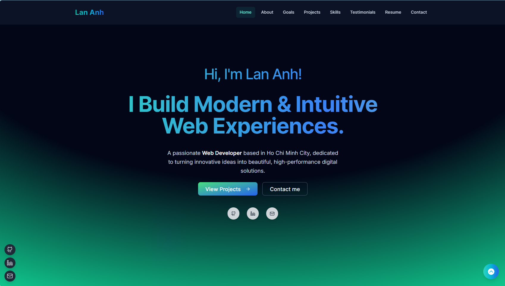

### About Me Section


### Career Goals Section

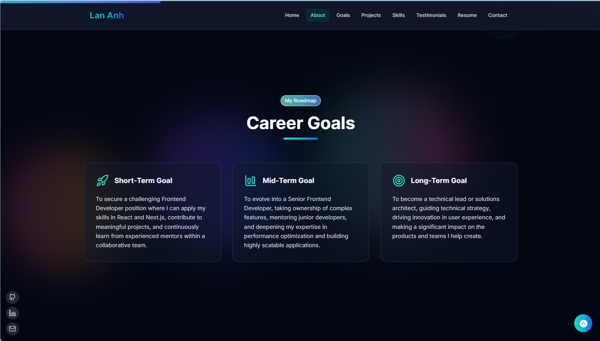

### Projects Section

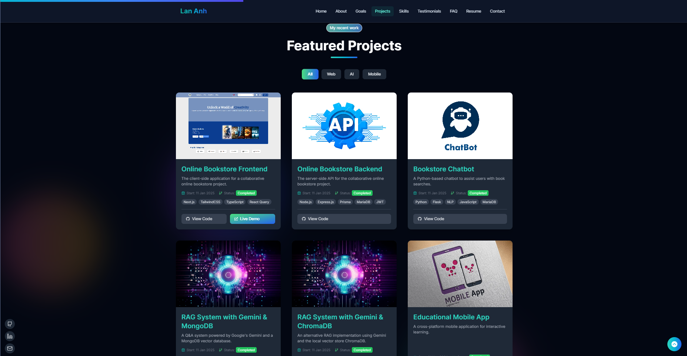

### Skills Section

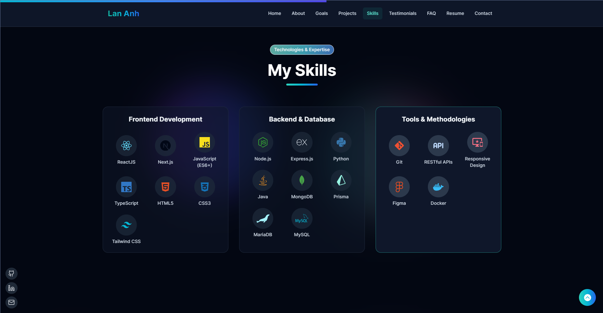

### Testimonials Section

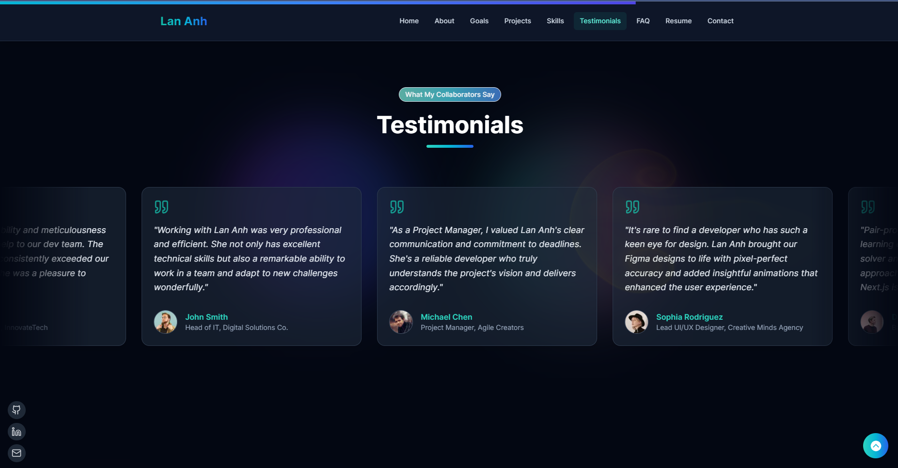

### FAQ Section

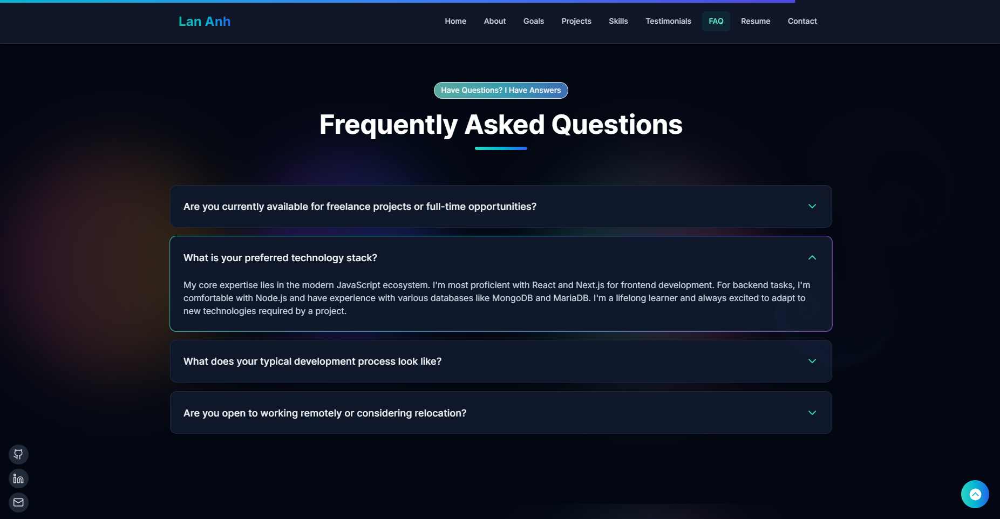

### Resume Section

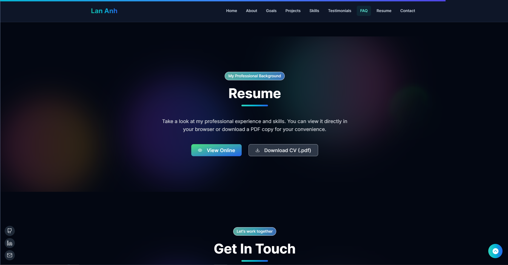

### Contact Section

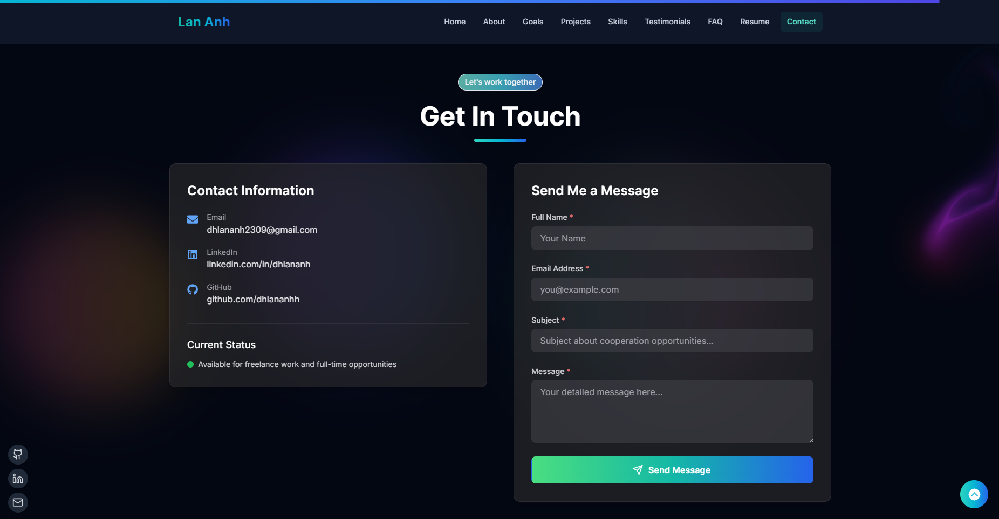

### Project Details Page

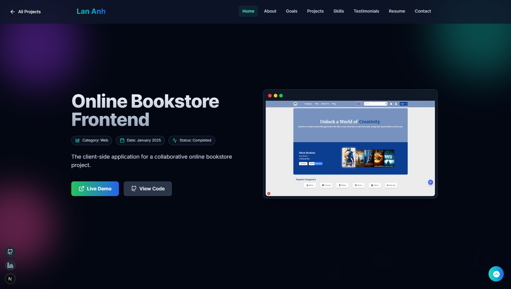

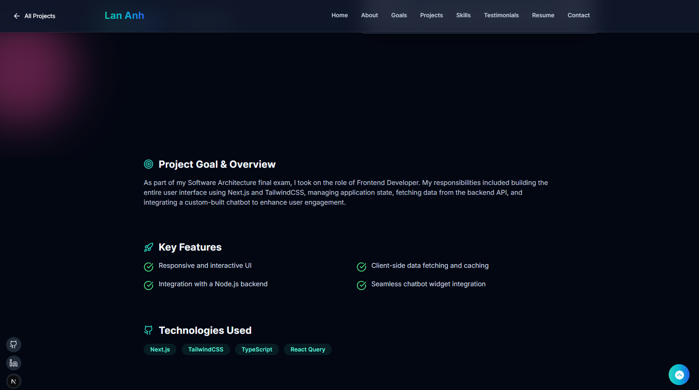

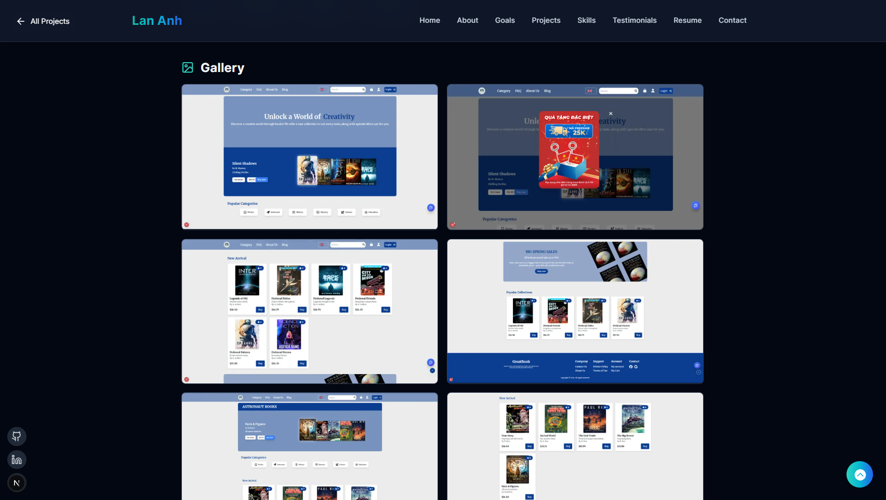

---

## 📩 Contact

<p>
  I'm currently seeking new opportunities as a Junior Developer. If you're interested in my work or have any questions, please feel free to connect with me!
</p>

<div align="left">
  <a href="https://linkedin.com/in/dhlananh" target="_blank" rel="noopener noreferrer">
    
  </a>
  <a href="mailto:dhlananh2309@gmail.com">
    
  </a>
  <a href="https://github.com/dhlananhh">
    
  </a>
</div>

<p>
  Thank you for visiting my repository!
</p>
